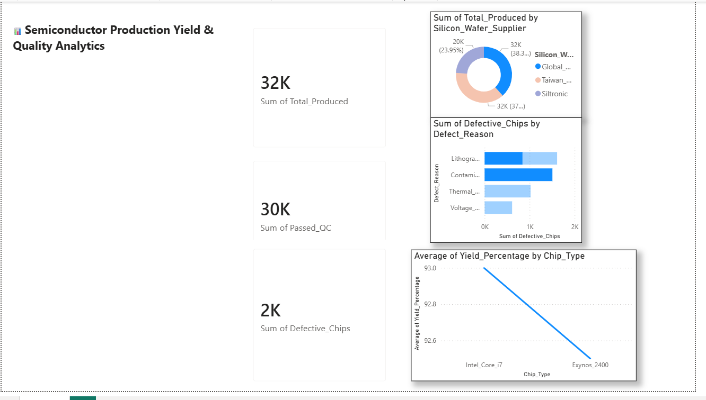

# 📊 Semiconductor Yield & Quality Analytics Dashboard

An industry-aligned Power BI dashboard engineered to monitor manufacturing line output, isolate component defect root causes, and track silicon wafer supplier quality matrices.

## 📈 Dashboard Live Preview

## 🛠️ Data Infrastructure & Analytics Stack
- **Bi-Platform Architecture:** Power Query data ingestion matrix tracking fixed-point metrics.
- **DAX Calculations:** Custom calculated columns mapping operational `Yield_Percentage`.
- **Core Insights:** Pinpoints critical performance drops (e.g., Lithography Errors vs Thermal Throttling) across distributed fabrication lines.
